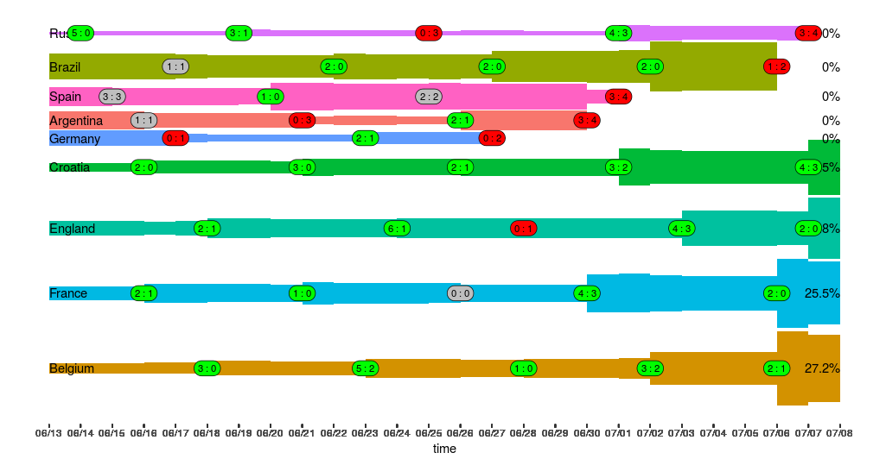

# Simulate FIFA 2018 results using Monte Carlo

## Preparation
1. Clone this repository `git clone https://github.com/hbuchta/fifa2018`
2. Download dataset with international football results: https://www.kaggle.com/martj42/international-football-results-from-1872-to-2017/data
3. place this file in the data subdirectory of the project
4. Modify the script parameters in R/fifa2018 (see section below for details)

## Script parameters

| Parameter | sample value | description |
| --- | --- | --- |
| `opt.date` | `as.Date("2018-06-20")` |  For evaluation the strength of each team, existing results are used up to the following date. Forecast of future results is computed started from the day after this date
| `opt.rounds` | `100000` | number of monte carlo rounds
| `opt.years` | `30` | number of years backwards to estimate the strength of each team. Older matches are not taken into account
| `opt.fulldecay` | `0.01` | for estimating the strength of each team, games are weighted depending so that recent games are weighted more than past games. This factor gives the weight for games at the age of `opt.fulldecay`

## Some results
This script in `R/fifa2018_results.R` is used to plot some results. The following chart shows the situation up until June 20, 2018. The percentage value shows the probability for the team to win the world cup. As you can see the chances for Germany are reduced after loosing against Mexico, then getting better after winning against Sweden and finally dropping to 0% when loosing against the Korea Republic. In the first simulation (before the world cup started), Brazil was scored best with 10%, followed by Spain (8%) and Argentina (7.5%). During the world cup positions changed a lot with Spai currently leading.

